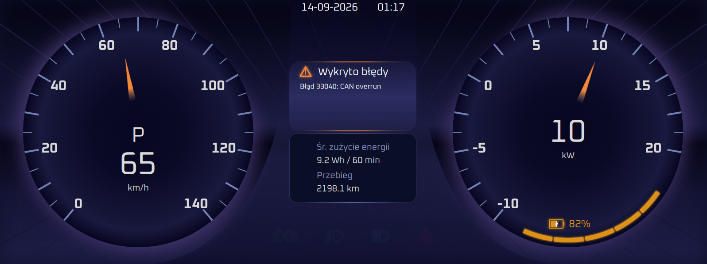

<div align="center">

**🇬🇧 English** · [🇵🇱 Polski](README.pl.md)

# Perła — Driver Display

**Qt/QML digital instrument cluster for the *Perła* electric vehicle**

[](https://www.qt.io/)
[](https://isocpp.org/)
[](https://cmake.org/)
[](#)



</div>

---

## Overview

The driver-facing instrument cluster of the **Perła** electric vehicle, built by the **Eko-Energia AGH** student team. It renders live telemetry as a frameless, fixed-layout 1600×600 dashboard.

The application never touches the CAN bus itself. It consumes two WebSocket feeds:

- **`ws://localhost:8080`** — CAN frames, from [dbc-can-bridge](https://github.com/Eko-Energia/dbc-can-bridge)
- **`ws://localhost:8081`** — GPS/Raspberry Pi telemetry (speed, odometer, energy, fault codes), from [rpi_utilities](https://github.com/Eko-Energia/rpi_utilities)

Both **must be running** for the display to show data. Either socket reconnects on its own once per second after a drop.

## What it shows

- Speedometer (0–140 km/h) with PRND drive mode
- Bidirectional power meter (−10…20 kW, negative = regeneration)
- Battery state of charge — glowing arc plus a numeric readout
- Headlights (parking / low / high beam), hazards and turn indicators
- Fault pop-up — active fault codes, each expiring after 60 s
- Trip data — average energy consumption and total odometer
- Date and time

## Requirements

**To run**

- Linux with SocketCAN support
- [dbc-can-bridge](https://github.com/Eko-Energia/dbc-can-bridge) — CAN → WebSocket gateway, port `8080`
- [rpi_utilities](https://github.com/Eko-Energia/rpi_utilities) — telemetry service, port `8081`

## Configuring subscriptions

The app subscribes only to the CAN frames it needs. The list lives in [subs.txt](subs.txt), one frame per line:

```
FRAME_NAME|SIGNAL_1,SIGNAL_2,SIGNAL_3
```

Blank lines and lines starting with `#` are ignored. The file is embedded as a Qt resource, so **editing it requires a rebuild**.

## Known limitations

- State of charge is a linear voltage approximation — `(V − 63) / 24 × 100` — a placeholder until the BMS provides a proper estimate.
- The layout is pinned to 1600×600 with absolute positioning, matching the physical display.
- Both WebSocket addresses are hard-coded in [main.cpp](src/main.cpp).
- The warning row, cruise-control indicator and outside-temperature readout exist in the sources but are disabled, pending data sources.

## Credits

**Author** — Igor Lelito · Eko-Energia AGH

Typeface: [Oxanium](https://fonts.google.com/specimen/Oxanium), used under the SIL Open Font License ([OFL.txt](fonts/OFL.txt)).
